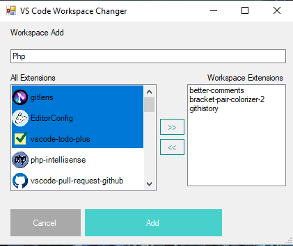
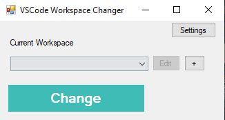
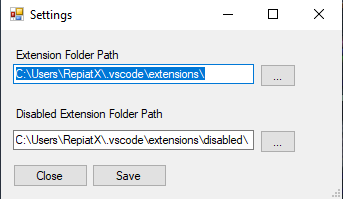

# VS Code Workspace Changer

if you are using VSCode for multiple project (Web, Desktop ...) then you suffocated like me . With this tool you can easily switch between workspaces.

- Open the program and click "**Settings**" button.
- Select **extensionFolder** ( Windows: C:\Users\<User>\\.vscode\extensions ).
- Select **disabledExtensionFolder**( Windows: C:\Users\<User>\\.vscode\extensions\disabled ) click save.
- Create a Workspace by pressing "**+**" button.
- Enter Workspace name and select extension then press "**Add**"

now you can add one more to switch between them.

don't hesitate to send bug report to me.

